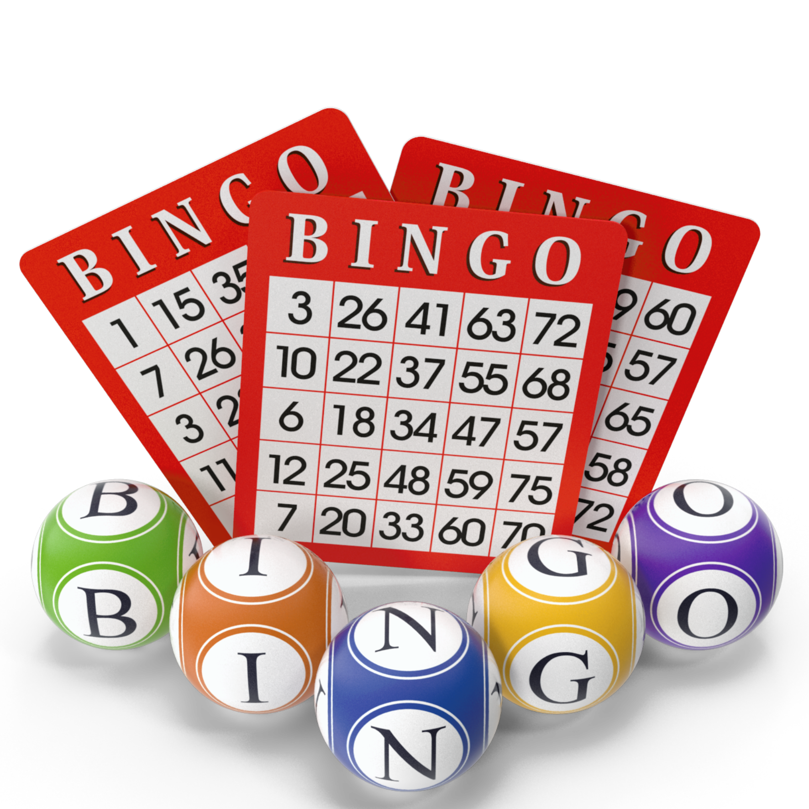

# 🎯 Sistema de Bingo

[](https://github.com/seu-usuario/bingo)
[](LICENSE)
[](https://developer.mozilla.org/pt-BR/docs/Web/HTML)
[](https://developer.mozilla.org/pt-BR/docs/Web/CSS)
[](https://developer.mozilla.org/pt-BR/docs/Web/JavaScript)

Um sistema completo de Bingo com interface moderna, animações, geração de cartelas em PDF e salvamento automático.



---

## 📋 Índice

- [Sobre o Projeto](#-sobre-o-projeto)
- [Funcionalidades](#-funcionalidades)
- [Tecnologias Utilizadas](#-tecnologias-utilizadas)
- [Estrutura do Projeto](#-estrutura-do-projeto)
- [Instalação e Uso](#-instalação-e-uso)
- [Como Jogar](#-como-jogar)
- [Atalhos do Teclado](#-atalhos-do-teclado)
- [Personalização](#-personalização)
- [Contribuição](#-contribuição)
- [Licença](#-licença)
- [Autor](#-autor)

---

## 🎯 Sobre o Projeto

O **Sistema de Bingo** é uma aplicação web interativa que simula um jogo de bingo tradicional com 75 números. Desenvolvido com HTML, CSS e JavaScript puro, oferece uma experiência completa com animações, sons, temas claro/escuro e geração de cartelas em PDF.

### ✨ Características Principais

- **Interface Intuitiva**: Design limpo e responsivo
- **Roleta Animada**: Efeito visual e sonoro ao sortear números
- **Cartelas em PDF**: Geração automática de cartelas únicas
- **Salvamento Automático**: Persistência dos dados no localStorage
- **Temas**: Alternância entre modo claro e escuro
- **Modo Tela Cheia**: Experiência imersiva
- **Acessibilidade**: Suporte a leitores de tela e atalhos de teclado

---

## 🚀 Funcionalidades

### 🎲 Sorteio de Números
- Sorteio aleatório de números de 1 a 75
- Animação de roleta com efeitos visuais
- Som de roleta durante o sorteio
- Destaque dos números sorteados
- Exibição da letra correspondente (B, I, N, G, O)

### 📊 Painel de Controle
- **Botão Sortear**: Realiza um novo sorteio
- **Contador**: Números sorteados e restantes
- **Status de Salvamento**: Indica quando os dados são salvos
- **Botão Reset**: Reinicia o jogo (com confirmação)

### 🎨 Personalização
- **Tema Claro/Escuro**: Alternância com persistência
- **Tela Cheia**: Modo imersivo para apresentações
- **Responsividade**: Adapta-se a todos os tamanhos de tela

### 📄 Geração de Cartelas
- Geração de cartelas únicas e aleatórias
- Layout profissional em PDF (A4)
- 4 cartelas por página
- Espaço central "FREE" em todas as cartelas
- Números distribuídos pelas colunas B, I, N, G, O

### 💾 Persistência de Dados
- Salvamento automático a cada sorteio
- Restauração do estado do jogo ao recarregar
- Salvamento manual com Ctrl+S
- Histórico de números sorteados

### ♿ Acessibilidade
- Leitores de tela (aria-live, aria-label)
- Atalhos de teclado
- Contraste adequado
- Texto alternativo em imagens

---

## 🛠️ Tecnologias Utilizadas

### Frontend
- **HTML5**: Estrutura semântica
- **CSS3**: Estilização com variáveis CSS e animações
- **JavaScript (ES6+)**: Lógica do jogo e interações

### Bibliotecas
- **jsPDF**: Geração de cartelas em PDF
- **html2canvas**: Renderização para PDF (fallback)

### Recursos
- **localStorage**: Persistência de dados
- **Fullscreen API**: Modo tela cheia
- **Web Audio API**: Efeitos sonoros

---

## 📁 Estrutura do Projeto
  bingo/
├── index.html # Página principal
├── style.css # Estilos CSS
├── script.js # Lógica JavaScript
├── README.md # Documentação
├── LICENSE # Licença
├── img/
│ ├── icone.png # Ícone do sistema (favicon)
│ ├── bingo.png # Logo/Imagem central
│ └── (outras imagens)
├── sounds/
│ └── SomRoleta.mp3 # Efeito sonoro da roleta
└── assets/
└── (recursos adicionais)


---

## 💻 Instalação e Uso

### Pré-requisitos
- Navegador moderno (Chrome, Firefox, Edge, Safari)
- Conexão com internet (para bibliotecas CDN)

### Instalação

1. **Clone o repositório**
```bash
git clone https://github.com/seu-usuario/bingo.git
cd bingo

Estrutura de arquivos
Certifique-se de ter a seguinte estrutura:
bingo/
├── index.html
├── style.css
├── script.js
├── img/
│   ├── icone.png
│   └── bingo.png
└── sounds/
    └── SomRoleta.mp3

Execute o projeto

Abra o arquivo index.html no navegador

Ou use um servidor local:

# Com Python
python -m http.server 8000

# Com Node.js (http-server)
npx http-server

# Com VS Code (Live Server)
# Instale a extensão e clique em "Go Live"

Configuração
Personalizando Cores
Edite as variáveis CSS no arquivo style.css:

:root {
  --primary: #0b66ff;        /* Cor principal */
  --success: #22c55e;        /* Números sorteados */
  --danger: #ef4444;         /* Botão reset */
  --warning: #f59e0b;        /* Destaques */
  --bg: #f8fafc;            /* Fundo */
  --card-bg: #ffffff;        /* Cards */
  --text: #111;             /* Texto */
}

Alterando o Som da Roleta
Substitua o arquivo sounds/SomRoleta.mp3 ou altere o caminho no JavaScript:

const rouletteSound = new Audio('sounds/SomRoleta.mp3');

🎮 Como Jogar
Passo a Passo
Inicie o Jogo

O jogo começa com todos os números disponíveis

O status mostra "Sorteados: 0/75"

Sorteie um Número

Clique no botão "Sortear" ou pressione Espaço

A roleta animada mostrará o número sorteado

O número será destacado nos painéis

O contador será atualizado automaticamente

Marque as Cartelas

Imprima ou visualize as cartelas geradas

Marque os números sorteados

O primeiro a completar uma cartela vence!

Gere Cartelas

Clique em "Cartelas" ou pressione Ctrl+C

Escolha a quantidade de cartelas (1-100)

Clique em "Gerar PDF"

Imprima as cartelas para os jogadores

Reinicie o Jogo

Clique em "Resetar" ou pressione Ctrl+R

Confirme a ação na janela modal

Todos os números serão reiniciados

⌨️ Atalhos do Teclado
Tecla	Ação
Espaço	Sortear próximo número
Enter	Sortear próximo número
Ctrl + R	Resetar jogo
Ctrl + S	Salvar manualmente
Ctrl + T	Alternar tema
Ctrl + C	Abrir gerador de cartelas
Ctrl + F	Alternar tela cheia
Esc	Fechar modais

🎨 Personalização
Adicionando Novas Funcionalidades
1. Modo Automático
// Adicione ao script.js
let autoMode = false;
function toggleAutoMode() {
  autoMode = !autoMode;
  if (autoMode) {
    autoInterval = setInterval(drawNumber, 3000);
  } else {
    clearInterval(autoInterval);
  }
}

 Histórico de Sorteios

function saveHistory() {
  const history = {
    date: new Date().toISOString(),
    numbers: drawn
  };
  // Salvar no localStorage ou exportar
}

Personalização de Temas

/* Adicione novos temas no style.css */
body.pink-theme {
  --primary: #ec4899;
  --card-bg: #fdf2f8;
}

Customizando o Layout
Alterar Tamanho dos Números

.num {
  width: 40px;     /* Aumentar */
  height: 40px;
  font-size: 14px;
}

Modificar Grid de Números

// No script.js, ajuste os parâmetros
createNumberRow(leftNumbers, 1, 5);  // Altere os ranges

🤝 Contribuição
Contribuições são sempre bem-vindas! Siga os passos abaixo:

Fork o projeto

Crie sua branch

bash
git checkout -b feature/nova-funcionalidade
Commit suas alterações

bash
git commit -m 'Adiciona nova funcionalidade'
Push para a branch

bash
git push origin feature/nova-funcionalidade
Abra um Pull Request

Diretrizes de Contribuição
Mantenha o código limpo e organizado

Siga o padrão de código existente

Adicione comentários quando necessário

Atualize o README se adicionar novas funcionalidades

Teste em diferentes navegadores

📝 Licença
Este projeto está sob a licença MIT. Veja o arquivo LICENSE para mais detalhes.

👨‍💻 Autor
Edivaldo Chaves

🌐 GitHub: @edivaldochaves

🎯 Sistema de Bingo - Todos os direitos reservados

🙏 Agradecimentos

jsPDF - Biblioteca de geração de PDF

html2canvas - Renderização de elementos

Mixkit - Efeitos sonoros

A todos os contribuidores e usuários do sistema

📊 Status do Projeto
✅ Versão Estável: 2.0

🔄 Última Atualização: 2025

📱 Compatível com dispositivos móveis

🌐 Funciona offline (após primeiro carregamento)

🐛 Relatar Problemas
Encontrou um bug? Abra uma issue no GitHub com:

Descrição do problema

Passos para reproduzir

Comportamento esperado

Screenshots (se aplicável)

Navegador e versão

📈 Roadmap
Modo multiplayer online

Chat durante o jogo

Estatísticas avançadas

Exportação de resultados em CSV

Versão PWA para instalação

Integração com impressora

Múltiplos idiomas

Sistema de pontuação

❓ FAQ
Como gerar mais de 100 cartelas?

Modifique o atributo max="100" no input para o valor desejado.

O som não está funcionando?

Verifique se o arquivo sounds/SomRoleta.mp3 existe

Permita reprodução de áudio no navegador

O sistema tem fallback com som alternativo

Como mudar a imagem central?

Substitua img/bingo.png por sua própria imagem

Ou modifique o fallback no atributo onerror da tag 

Os dados são perdidos ao limpar o cache?

Sim, os dados são salvos no localStorage. Se limpar, os dados serão perdidos.

🌟 Demonstração
Uma versão de demonstração está disponível em:
[Seu-link-de-demo]

📄 Changelog
v2.0 (2025)
✨ Adicionado rodapé com ícone

✨ Sistema de temas (claro/escuro)

✨ Salvamento automático

✨ Geração de cartelas em PDF

✨ Modo tela cheia

✨ Animações e efeitos sonoros

🐛 Correções de bugs e melhorias de performance

v1.0 (2024)
🎉 Lançamento inicial

Sorteio de números

Interface básica

Feito com ❤️ por Edivaldo Chaves

Nota: Este sistema foi desenvolvido para fins educacionais e de entretenimento. Use com responsabilidade.
